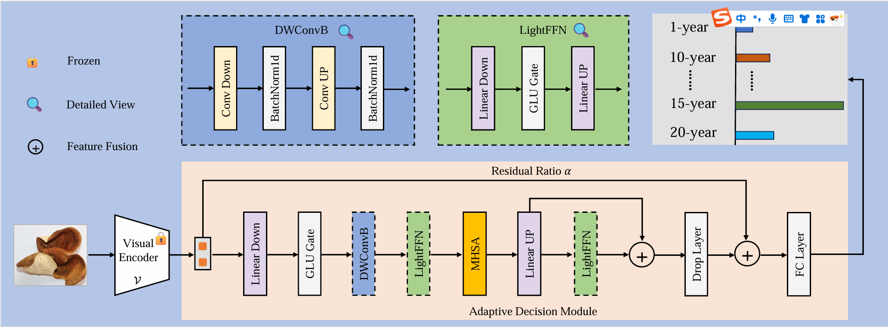

# CLIP-Adaptive Decision Method for Age Recognition of Pericarpium Citri Reticulatae

This is the architecture of our proposed CLIP-Adaptive Decision Framework:

## Environment Dependencies

Please ensure your Python environment includes the following package versions:

```bash
ftfy==6.3.1
matplotlib==3.10.3
numpy==2.2.6
Pillow==11.2.1
regex==2024.9.11
scikit_learn==1.6.1
torch==2.5.0+cu124
torchvision==0.20.0+cu124
tqdm==4.66.5

You can install the dependencies using: pip install -r requirements.txt
The torch and torchvision versions include CUDA 12.4 support. Please adjust the versions according to your CUDA setup.
